### Hi there, I'm Manuele - aka [D3strukt0r][website] 👋

## I'm a Student and Developer!!

- 🌱 I’m currently learning everything 🤣

### Connect with me

[][website]
[][youtube]
[][twitter]
[][linkedin]

### Languages and Tools

---

⚡ Recent GitHub Activity

<!--START_SECTION:activity-->
1. 🗣 Commented on [#190](https://github.com/D3strukt0r/weleda-webcenter-text-export/pull/190#issuecomment-4468184653) in [D3strukt0r/weleda-webcenter-text-export](https://github.com/D3strukt0r/weleda-webcenter-text-export)
2. ℹ️ Labeled PR [#190](https://github.com/D3strukt0r/weleda-webcenter-text-export/pull/190) in [D3strukt0r/weleda-webcenter-text-export](https://github.com/D3strukt0r/weleda-webcenter-text-export)
3. ℹ️ Unlabeled PR [#190](https://github.com/D3strukt0r/weleda-webcenter-text-export/pull/190) in [D3strukt0r/weleda-webcenter-text-export](https://github.com/D3strukt0r/weleda-webcenter-text-export)
4. 🚀 Published release [v3.0.1](https://github.com/D3strukt0r/weleda-webcenter-text-export/releases/tag/3.0.1) in [D3strukt0r/weleda-webcenter-text-export](https://github.com/D3strukt0r/weleda-webcenter-text-export)
5. 🎉 Merged PR [#190](https://github.com/D3strukt0r/weleda-webcenter-text-export/pull/190) in [D3strukt0r/weleda-webcenter-text-export](https://github.com/D3strukt0r/weleda-webcenter-text-export)
<!--END_SECTION:activity-->

---

⚡ GitHub Stats

[][github]

[][github]

[github]: https://github.com/D3strukt0r
[website]: https://d3strukt0r.dev
[twitter]: https://twitter.com/D3strukt0r1
[youtube]: https://www.youtube.com/channel/UCivybMDjH_Ec-ajvgm94o4g
[linkedin]: https://www.linkedin.com/in/d3strukt0r/
